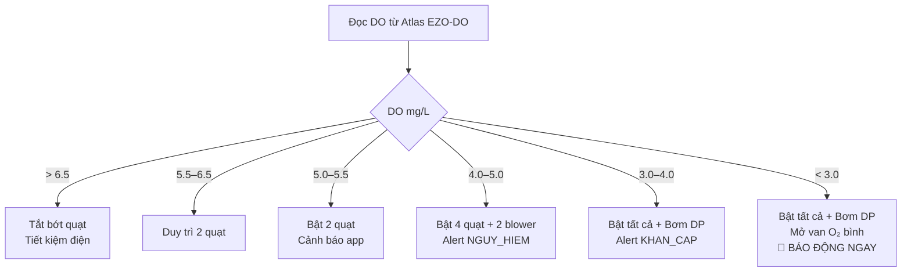
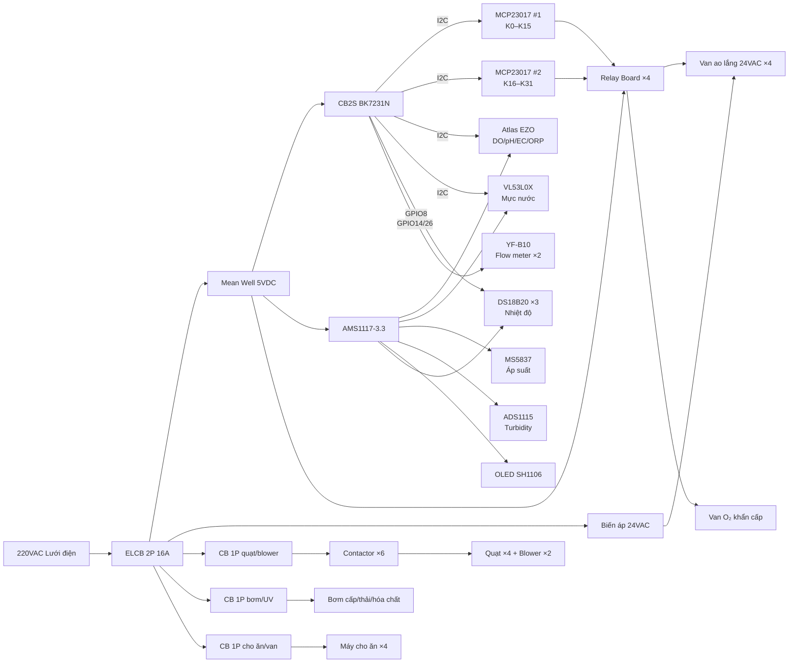
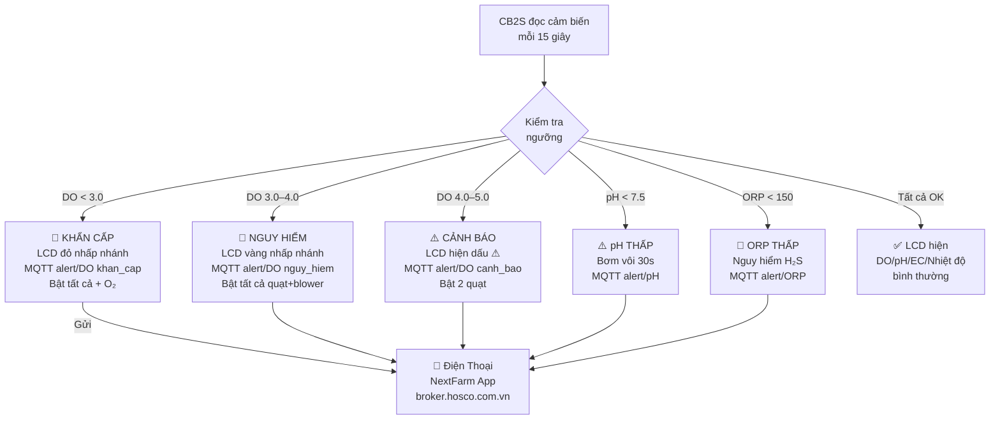

# 02 — Kiến Trúc Hệ Thống

---

## 2.1 Sơ Đồ Tổng Quan Hệ Thống

```
┌──────────────────────────────────────────────────────────────────┐
│                    NEXTFARM PLATFORM                              │
│              IoT → Aquaculture (broker.hosco.com.vn)             │
└────────────────────────────┬─────────────────────────────────────┘
                             │ WiFi MQTT Port 1883
                             │
               ┌─────────────┴──────────────┐
               │       CB2S (BK7231N)        │
               │    Chip Tuya, 3.3V I/O      │
               │  ID: Mã khách (VD: TOM_001) │
               └──────┬──────────────────────┘
                      │ I2C Bus (SDA=GPIO0, SCL=GPIO1)
         ┌────────────┼────────────────────────────────────┐
         │            │            │           │            │
    ┌────┴────┐  ┌────┴────┐  ┌───┴────┐  ┌──┴─────┐  ┌──┴──────┐
    │MCP23017 │  │MCP23017 │  │ADS1115 │  │Atlas   │  │ VL53L0X │
    │  0x20   │  │  0x21   │  │  0x48  │  │EZO ×4  │  │ MS5837  │
    │K0–K15   │  │K16–K31  │  │Turbidity│  │DO/pH/  │  │OLED     │
    └────┬────┘  └────┬────┘  │Analog  │  │EC/ORP  │  └─────────┘
         │            │       └────────┘  └────────┘
   ┌─────┴──────┐  ┌──┴──────────────┐
   │Relay Board │  │Relay Board       │
   │  1+2       │  │  3+4             │
   │ K0–K15     │  │ K16–K31          │
   └─────┬──────┘  └──┬──────────────┘
         │             │
   220VAC + 24VAC   220VAC + 24VAC
         │             │
   ┌─────┴──────┐  ┌───┴──────────────┐
   │K0  Bơm cấp │  │K16-19 Van ao lắng│
   │K1-4 Quạt  │  │K20-23 Máy cho ăn │
   │K5-6 Blower│  │K24-25 Van xả đáy │
   │K7  Bơm xả │  │K28   Bơm DP      │
   │K9  Bơm vôi│  │K29   Van O₂      │
   │K11 Đèn UV │  └──────────────────┘
   └────────────┘
```

---

## 2.2 Sơ Đồ Khối Phần Cứng Chi Tiết

```
220VAC ─── [CB 2P 16A ELCB] ─────────────────────────────────────────
                │
    ┌───────────┼──────────────────────────────────────┐
    │           │                                       │
[CB 1P 20A]  [Mean Well HDR-60-5]              [Biến áp 24VAC]
(quạt+blower)  5VDC / 12A                         50VA
    │           │                                   │
[CB 1P 10A]  ┌─┴────────────────┐              Van ao lắng
(bơm+UV+đèn) │  5V Rail         │              K16–K19
    │        ├──────────────────┤              (24VAC NC)
[CB 1P 6A]   │  CB2S (3.3V reg) │
(cho ăn+van) │  MCP23017 ×2     │
    │        │  Relay coil ×32  │
    │        └──────────────────┘
    │                │
    │         [AMS1117-3.3]  ← 5V → 3.3V
    │                │
    │         3.3V Sensor Rail:
    │         ├── Atlas EZO-DO  (I2C 0x61)
    │         ├── Atlas EZO-ORP (I2C 0x62)
    │         ├── Atlas EZO-pH  (I2C 0x63)
    │         ├── Atlas EZO-EC  (I2C 0x64)
    │         ├── VL53L0X mực nước (I2C 0x29)
    │         ├── MS5837-30BA áp suất (I2C 0x76)
    │         ├── SEN0189 turbidity → ADS1115 AIN0
    │         ├── ADS1115 (I2C 0x48)
    │         ├── OLED SH1106 (I2C 0x3C)
    │         ├── DS18B20 ×3 (1-Wire GPIO8 + 4.7kΩ)
    │         ├── YF-B10 cấp (GPIO14 pulse)
    │         └── YF-B10 thải (GPIO26 pulse)
    │
    ├── K1–K4: [Contactor 9A] → Quạt sục khí 1.1kW ×4
    ├── K5–K6: [Contactor 9A] → Root Blower 0.75kW ×2
    ├── K0:    [Contactor 9A] → Bơm cấp nước 0.75HP
    ├── K7–K8: Bơm thải + Bơm tuần hoàn
    ├── K9–K10: Bơm vôi + Bơm khoáng (định lượng)
    ├── K11:   Đèn UV 40W
    ├── K12:   Bộ sưởi nước
    ├── K13–K14: Đèn ao
    ├── K20–K23: Máy cho ăn ×4
    ├── K24–K27: Van xả + Bơm bùn + Van thải
    ├── K28:   [Contactor] → Bơm dự phòng DP
    └── K29:   Van O₂ bình khẩn cấp
```

---

## 2.3 Sơ Đồ Mermaid — Luồng Điều Khiển DO



---

## 2.4 Sơ Đồ Mermaid — Kiến Trúc Phần Cứng



---

## 2.5 Sơ Đồ Mermaid — Cảnh Báo LCD + App



---

## 2.6 Sơ Đồ Nguồn Điện

```
                    220VAC (Lưới điện)
                         │
              ┌──────────┴──────────┐
              │   Aptomat 2P 16A    │
              │   ELCB 30mA         │ ← BẮT BUỘC
              └──────────┬──────────┘
                         │
    ┌────────────────────┼────────────────────────┐
    │                    │                        │
    ▼                    ▼                        ▼
[CB 1P 20A]     [Mean Well HDR-60-5]      [Biến áp 24VAC]
Quạt + Blower    5VDC / 12A DIN rail       50VA Xuyến
    │                    │                     │
    ▼                    ├→ CB2S (3.3V reg)  24VAC → Van K16–K19
[Contactor ×6]           ├→ MCP23017 ×2
Quạt 1.1kW ×4            ├→ Relay coil ×32
Blower 0.75kW ×2         └→ AMS1117-3.3 → 3.3V
                                               │
[CB 1P 10A]                              Cảm biến:
Bơm + UV                                 Atlas EZO ×4
Đèn + Sưởi                               VL53L0X
    │                                    MS5837-30BA
    ▼                                    SEN0189
 K7–K12                                  DS18B20 ×3
                                         ADS1115
[CB 1P 6A]                               OLED SH1106
Cho ăn K20–K23
Van xả K24–K27
    │
    ▼
 K20–K29

[CB 1P 6A]  ← Nguồn DC + 24VAC (điều khiển)
```

---

## 2.7 Logic Tự Động — Tóm Tắt

### DO — Ưu Tiên Tuyệt Đối

| DO (mg/L) | Quạt | Blower | Bơm DP | Van O₂ | LCD | App |
|:---------:|:----:|:------:|:------:|:------:|-----|-----|
| > 6.5 | 2 (tiết kiệm) | OFF | OFF | OFF | Xanh | — |
| 5.5–6.5 | 2 | OFF | OFF | OFF | Bình thường | — |
| 5.0–5.5 | 2 | OFF | OFF | OFF | ⚠️ | Thông báo |
| 4.0–5.0 | 4 | 2 | OFF | OFF | 🔴 nhấp nháy | Cảnh báo |
| 3.0–4.0 | 4 | 2 | ON | OFF | 🔴 nhấp nháy | Khẩn cấp |
| < 3.0 | 4 | 2 | ON | **ON** | 🚨 đỏ toàn màn | **BÁO ĐỘNG** |

### pH — Tự Động Bơm Vôi

```
pH < 7.5 → Bơm vôi 30 giây → Chờ 2 giờ → Đo lại
pH > 8.5 → Cảnh báo + Tăng thay nước
pH < 7.0 → Khẩn cấp + Báo app ngay
```

### Cho Ăn — Kiểm Tra DO Trước

```
Đến giờ ăn → Kiểm tra DO
  DO ≥ 4.0 → Chạy máy cho ăn
  DO < 4.0 → BỎ QUA (tôm/cá không ăn khi thiếu oxy)
           → Ghi log + báo app "BO_QUA_DO_THAP"
```

---

*[← Tổng Quan](01_tong-quan.md) | [Phần Cứng →](03_phan-cung.md)*
